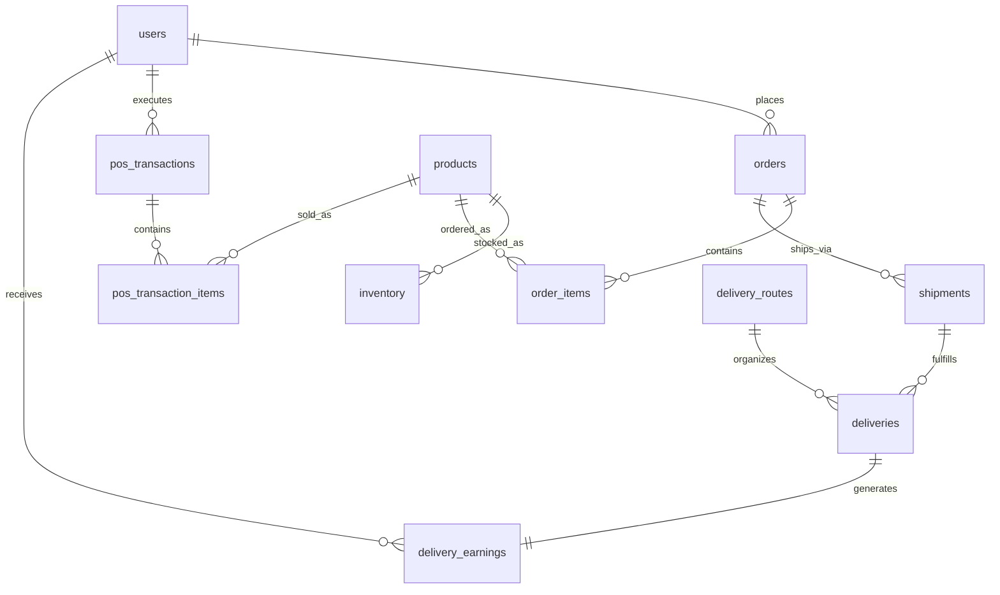

# Database Operations

This backend uses MySQL with Sequelize for runtime access and SQL files for structural assets.

## Runtime Overview

- Application bootstrap: `src/server.ts` initializes the database through `src/utils/initializeDatabase.ts`.
- Connection factory: `src/config/database.ts` authenticates, applies `sql/nestle_smartflow_mysql.sql`, and logs slow queries.
- Stored procedures: `sql/nestle_smartflow_procedures.sql`
- Procedure installer: `npm run db:procedures`
- Backup script: `scripts/backup-database.ps1`
- Restore script: `scripts/restore-database.ps1`

## Schema Diagram



## Key Tables

- `users`: auth identities and role assignments.
- `products`: master product catalog.
- `inventory`: stock by warehouse location and reorder controls.
- `orders`: manager-facing order lifecycle and fulfillment metadata.
- `order_items`: order line items.
- `shipments`: shipment grouping between orders and deliveries.
- `delivery_routes`: route planning and progress state.
- `deliveries`: delivery execution, proof, and issue history.
- `pos_transactions`: retailer POS headers.
- `pos_transaction_items`: retailer POS line items.
- `delivery_earnings`: driver payout accruals created on delivery completion.

## Query and Transaction Notes

- Orders, deliveries, and sales endpoints now support database-level pagination through validated `page` and `limit` query parameters.
- Retail POS checkout runs in a single SQL transaction that locks inventory rows, decrements stock, writes POS headers, and writes POS line items together.
- Delivery completion runs in a single SQL transaction that updates the delivery, closes the route when appropriate, and creates a delivery earnings record.
- Manager order creation runs in a single SQL transaction that resolves the customer, validates SKUs, writes the order header, and writes line items.
- Retailer inventory and POS product catalog reads use a short-lived in-memory cache and are invalidated on inventory mutation or checkout.

## Stored Procedures

- `sp_sales_summary(startDate, endDate)`: daily completed sales totals.
- `sp_inventory_reorder_report(multiplier)`: items at or below a reorder threshold multiplier.
- `sp_delivery_earnings_summary(startDate, endDate)`: earnings rollup per driver.

Apply procedures with:

```powershell
npm run db:procedures
```

## Backup and Restore

Create a backup:

```powershell
npm run db:backup
```

Restore the latest backup:

```powershell
npm run db:restore
```

Restore a specific file:

```powershell
powershell -ExecutionPolicy Bypass -File scripts/restore-database.ps1 -BackupFile backups/nestle_smartflow-YYYYMMDD-HHMMSS.sql
```

## Required Environment Variables

- `MYSQL_HOST`
- `MYSQL_PORT`
- `MYSQL_USER`
- `MYSQL_PASSWORD`
- `MYSQL_DATABASE`
- `MYSQL_TEST_DATABASE`
- `MYSQL_CONNECT_TIMEOUT_MS`
- `MYSQL_POOL_MIN`
- `MYSQL_POOL_MAX`
- `MYSQL_SLOW_QUERY_MS`
- `AUTO_SEED`